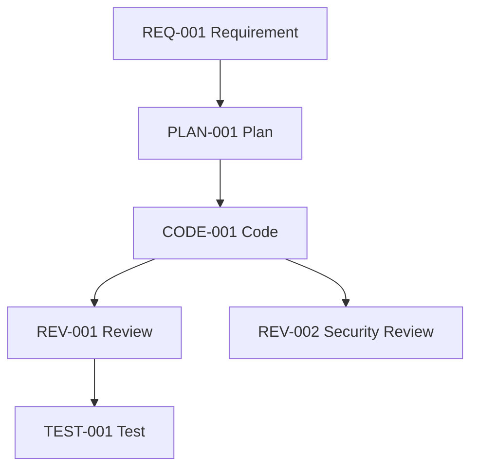

# Artifact Graph

## 1. Khái niệm

Graph = visualization của Lineage + Dependency DAG. Mỗi node là artifact, mỗi edge là quan hệ.

## 2. Edge types

| Edge | Từ | Đến | Ý nghĩa |
|------|----|-----|---------|
| parent | artifact | parent | cha con lineage |
| derived | artifact | derived_from | dẫn xuất từ |
| consumes | agent artifact | consumed artifact | agent dùng artifact |
| supersedes | old | new | phiên bản thay thế |
| depends | artifact | depends_on | phụ thuộc |

## 3. Mermaid

## 4. Graph query

- `trace(id)` — full lineage forward + backward.
- `impact(id)` — artifact nào bị ảnh hưởng nếu id thay đổi.
- `orphans()` — artifact không có edge vào/ra.

## 5. Tương tác

- `lineage.md` + `dependency.md` → data cho graph.
- Phase 9 (Knowledge Graph) — mở rộng thành full graph có tag + type + agent.
- Simulation (Phase 7) — traverse graph để mô phỏng.