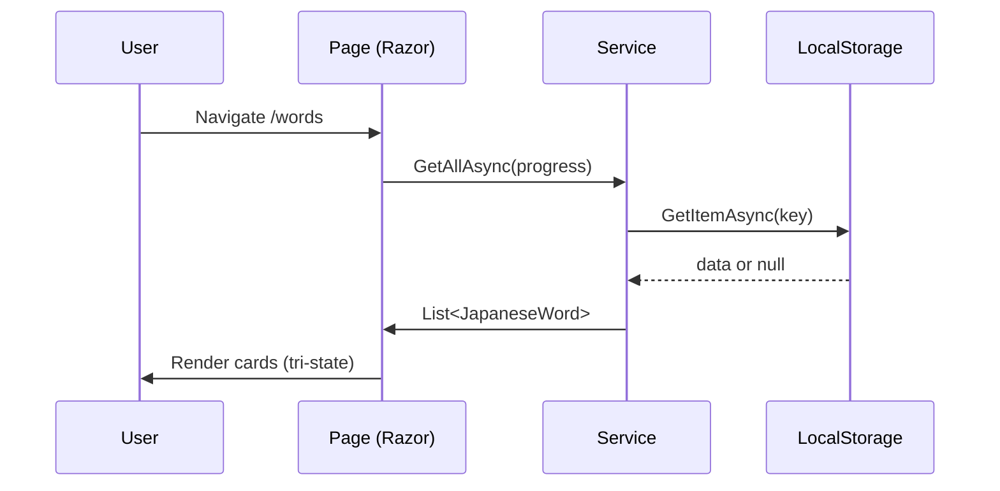

# Workflow Reader — Đọc Luồng Hoạt Động

Skill chuyên phân tích và mô tả luồng hoạt động của hệ thống từ code, diagram, và tài liệu.

## MỤC LỤC

- [TỔNG QUAN](#tổng-quan)
- [CÁC LOẠI FLOW](#các-loại-flow)
- [QUY TRÌNH](#quy-trình)
- [SINH DIAGRAM](#sinh-diagram)
- [OUTPUT CONTRACT](#output-contract)
- [QUY TẮC BẮT BUỘC](#quy-tắc-bắt-buộc)

---

## TỔNG QUAN

Mô tả luồng hoạt động từ code thực tế (không đoán) — phục vụ trả lời "màn hình này workflow thế nào", "luồng đăng ký người dùng ra sao".

### Command liên quan

| Command | Mô tả |
|---------|-------|
| `/flow <luồng nghiệp vụ>` | Sinh sequence + mermaid |
| `/trace <flow>` | Truy vết UI→API→DB→Response |

---

## CÁC LOẠI FLOW

| Flow | Mô tả | Ví dụ |
|------|-------|-------|
| **User Flow** | Các bước user tương tác UI | "Vào /words → chọn tab → bấm lật thẻ → chọn Đã biết/Chưa biết" |
| **Business Flow** | Luồng nghiệp vụ | "Admin thêm từ mới → validate → lưu LocalStorage → cập nhật list" |
| **API Flow** | Luồng API/service | "Home → load services → ProgressRing → render" |
| **State Machine** | Trạng thái + chuyển đổi | "Loading → Empty → Data" (tri-state rendering) |

---

## QUY TRÌNH

### Bước 1: Xác định luồng
Từ input, xác định màn hình/chức năng liên quan.

### Bước 2: Đọc code liên quan
Đọc page Razor + services liên quan. Theo dõi:
- User actions (onclick, onchange)
- Service calls (GetAllAsync, AddAsync...)
- State changes (isLoading, list.Count)

### Bước 3: Dựng sequence
Liệt kê các bước theo thứ tự thực thi thực tế.

### Bước 4: Trả lời
Mô tả flow bằng text + mermaid sequence diagram.

---

## SINH DIAGRAM

Mermaid sequence cho Blazor app:



---

## OUTPUT CONTRACT

```yaml
status: "READY | NOT_FOUND"
summary: "Tóm tắt luồng"
flow:
  name: "Tên luồng"
  type: "USER_FLOW | BUSINESS_FLOW | API_FLOW | STATE_MACHINE"
  steps:
    - order: 1
      description: "Mô tả bước"
      actor: "USER | PAGE | SERVICE | API | DB"
      evidence: "file:line"
  states: []  # cho STATE_MACHINE
  transitions: []  # cho STATE_MACHINE
  mermaid: "```mermaid ... ```"
evidence_sources:
  - file: "path/to/file"
    line: 42
issues: []
next_action: "Hành động tiếp theo"
```

---

## QUY TẮC BẮT BUỘC

1. **Từ code thực tế**: Mỗi bước flow kèm evidence file:line — không vẽ flow tưởng tượng.
2. **Mermaid hợp lệ**: Diagram phải parse được (cú pháp chuẩn).
3. **Nhiều nhánh**: Nếu có điều kiện (if/else) → mô tả cả nhánh.
4. Nếu không tìm thấy → `status: NOT_FOUND` kèm gợi ý.
